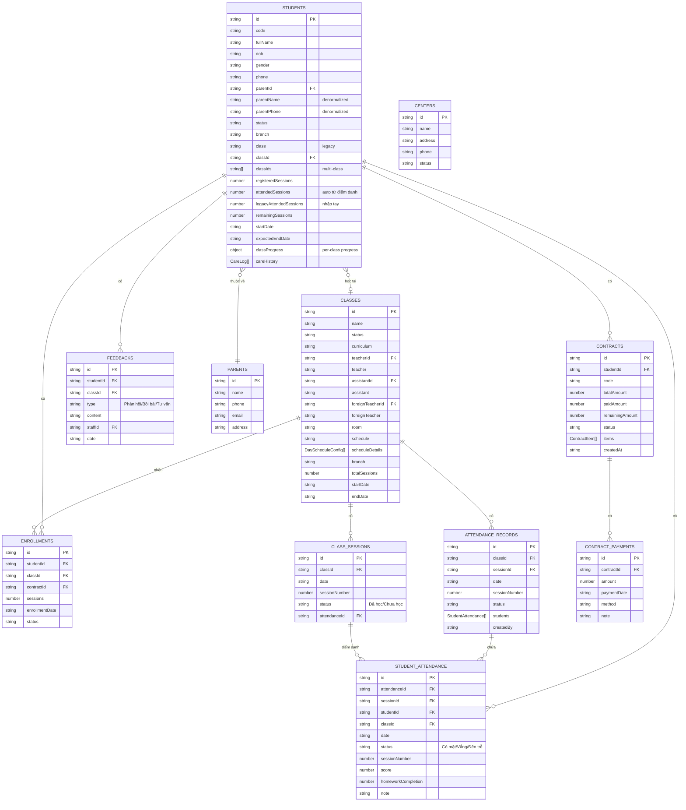

# Sơ Đồ Cấu Trúc Database - Trang Quản Lý Học Viên

## Tổng Quan

Trang `/customers/students` sử dụng các collection Firestore sau:

## Sơ Đồ ERD



## Chi Tiết Các Collection

### 1. `students` - Học Viên

**Các trường chính:**
- `id`: Document ID (tự động)
- `code`: Mã học viên (HV001, HV002...)
- `fullName`: Họ và tên
- `dob`: Ngày sinh (ISO date)
- `gender`: Giới tính (Nam/Nữ)
- `phone`: Số điện thoại phụ huynh
- `parentId`: Reference đến `parents` collection
- `parentName`, `parentPhone`: Denormalized (tự động sync)
- `status`: Trạng thái (Đang học, Nợ phí, Bảo lưu, Nghỉ học, Học thử...)
- `branch`: Cơ sở học
- `classId`: Lớp học chính (reference đến `classes`)
- `classIds[]`: Tất cả lớp học viên đang học (hỗ trợ multi-class)
- `registeredSessions`: Số buổi đã đăng ký/đóng tiền
  - **Excel column**: `Số buổi đăng ký (Gói học)`
- `attendedSessions`: Số buổi đã học (tự động tính từ điểm danh)
  - **Excel column**: `Đã điểm danh`
  - **Aliases**: "SỐ BUỔI ĐÃ HỌC ĐẾN NGÀY", "SỐ BUỔI ĐÃ HỌC", "ĐÃ HỌC", "ĐÃ ĐIỂM DANH"
- `legacyAttendedSessions`: Số buổi đã học từ hệ thống cũ (nhập tay)
  - **Excel column**: `Đã học`
  - **Aliases**: "ĐÃ HỌC (CŨ)", "Đã học cũ", "SỐ BUỔI ĐÃ HỌC (CŨ)", "Legacy Attended"
- `remainingSessions`: Số buổi còn lại (âm = nợ phí)
  - **Excel column**: `Số buổi còn lại`
- `classProgress`: Object theo từng lớp `{ [classId]: { registeredSessions, attendedSessions, ... } }`
- `careHistory[]`: Lịch sử chăm sóc (Bồi bài, Phản hồi, Tư vấn)

**Quan hệ:**
- `parentId` → `parents.id`
- `classId` → `classes.id`
- `classIds[]` → `classes.id[]`

### 2. `parents` - Phụ Huynh

**Các trường chính:**
- `id`: Document ID
- `name`: Tên phụ huynh
- `phone`: Số điện thoại
- `email`: Email
- `address`: Địa chỉ

**Quan hệ:**
- Nhiều học viên có thể thuộc 1 phụ huynh (query: `students` where `parentId == parents.id`)

### 3. `classes` - Lớp Học

**Các trường chính:**
- `id`: Document ID
- `name`: Tên lớp (Starters 22, Movers 15...)
- `status`: Trạng thái (Đang học, Tạm dừng, Kết thúc)
- `curriculum`: Chương trình học
- `teacherId`, `teacher`: Giáo viên Việt Nam
- `assistantId`, `assistant`: Trợ giảng
- `foreignTeacherId`, `foreignTeacher`: Giáo viên nước ngoài
- `schedule`: Lịch học tổng quát
- `scheduleDetails[]`: Chi tiết lịch học theo từng ngày
- `totalSessions`: Tổng số buổi học
- `branch`: Cơ sở

**Quan hệ:**
- `teacherId`, `assistantId`, `foreignTeacherId` → `staff.id`

### 4. `enrollments` - Đăng Ký

**Các trường chính:**
- `id`: Document ID
- `studentId`: Reference đến `students`
- `classId`: Reference đến `classes`
- `contractId`: Reference đến `contracts`
- `sessions`: Số buổi đăng ký
- `enrollmentDate`: Ngày đăng ký
- `status`: Trạng thái đăng ký

**Quan hệ:**
- `studentId` → `students.id`
- `classId` → `classes.id`
- `contractId` → `contracts.id`

### 5. `contracts` - Hợp Đồng

**Các trường chính:**
- `id`: Document ID
- `studentId`: Reference đến `students`
- `code`: Mã hợp đồng
- `totalAmount`: Tổng số tiền
- `paidAmount`: Đã thanh toán
- `remainingAmount`: Còn lại
- `status`: Trạng thái (Đã thanh toán, Chưa thanh toán)
- `items[]`: Danh sách các khoản (học phí, phí khác...)
- `createdAt`: Ngày tạo

**Quan hệ:**
- `studentId` → `students.id`

### 6. `contractPayments` - Thanh Toán Hợp Đồng

**Các trường chính:**
- `id`: Document ID
- `contractId`: Reference đến `contracts`
- `amount`: Số tiền
- `paymentDate`: Ngày thanh toán
- `method`: Phương thức thanh toán
- `note`: Ghi chú

**Quan hệ:**
- `contractId` → `contracts.id`

### 7. `attendanceRecords` - Bản Ghi Điểm Danh

**Các trường chính:**
- `id`: Document ID
- `classId`: Reference đến `classes`
- `sessionId`: Reference đến `classSessions`
- `date`: Ngày điểm danh
- `sessionNumber`: Số buổi học
- `status`: Trạng thái (Đã điểm danh, Chưa điểm danh)
- `students[]`: Mảng các học viên trong buổi điểm danh
- `createdBy`: Người tạo

**Quan hệ:**
- `classId` → `classes.id`
- `sessionId` → `classSessions.id`

### 8. `studentAttendance` - Điểm Danh Học Viên

**Các trường chính:**
- `id`: Document ID
- `attendanceId`: Reference đến `attendanceRecords`
- `sessionId`: Reference đến `classSessions` (có thể null nếu học bù)
- `studentId`: Reference đến `students`
- `classId`: Reference đến `classes`
- `date`: Ngày điểm danh
- `status`: Trạng thái (Có mặt, Vắng, Đến trễ, Đã bồi)
- `sessionNumber`: Số buổi học
- `score`: Điểm số (0-10)
- `homeworkCompletion`: % hoàn thành BTVN (0-100)
- `note`: Ghi chú

**Quan hệ:**
- `attendanceId` → `attendanceRecords.id`
- `sessionId` → `classSessions.id` (nullable)
- `studentId` → `students.id`
- `classId` → `classes.id`

### 9. `classSessions` - Buổi Học

**Các trường chính:**
- `id`: Document ID
- `classId`: Reference đến `classes`
- `date`: Ngày học
- `sessionNumber`: Số buổi học (1, 2, 3...)
- `status`: Trạng thái (Đã học, Chưa học)
- `attendanceId`: Reference đến `attendanceRecords` (nếu đã điểm danh)

**Quan hệ:**
- `classId` → `classes.id`
- `attendanceId` → `attendanceRecords.id` (nullable)

### 10. `feedbacks` - Phản Hồi

**Các trường chính:**
- `id`: Document ID
- `studentId`: Reference đến `students`
- `classId`: Reference đến `classes`
- `type`: Loại (Phản hồi, Bồi bài, Tư vấn)
- `content`: Nội dung
- `staffId`: Reference đến `staff`
- `date`: Ngày

**Quan hệ:**
- `studentId` → `students.id`
- `classId` → `classes.id`
- `staffId` → `staff.id`

### 11. `centers` - Cơ Sở

**Các trường chính:**
- `id`: Document ID
- `name`: Tên cơ sở
- `address`: Địa chỉ
- `phone`: Số điện thoại
- `status`: Trạng thái (Active, Inactive)

## Luồng Dữ Liệu Chính

### 1. Tạo Học Viên Mới
```
students (create) 
  → parentId → parents (lookup/create)
  → classId → classes (assign)
```

### 2. Đăng Ký Lớp
```
enrollments (create)
  → studentId → students
  → classId → classes
  → contractId → contracts (create)
```

### 3. Điểm Danh
```
attendanceRecords (create)
  → classId → classes
  → sessionId → classSessions
  → students[] → studentAttendance (create for each)
    → studentId → students (update attendedSessions)
```

### 4. Tính Số Buổi Còn Lại
```
students.remainingSessions = 
  registeredSessions - attendedSessions - legacyAttendedSessions
```

## Indexes Quan Trọng

```json
{
  "studentAttendance": [
    ["studentId", "classId", "date"],
    ["studentId", "status"]
  ],
  "students": [
    ["status", "createdAt"],
    ["classId", "status"]
  ],
  "classSessions": [
    ["classId", "date"],
    ["classId", "sessionNumber"],
    ["status", "date"]
  ]
}
```

## Notes

1. **Denormalization**: `students.parentName` và `students.parentPhone` được denormalize từ `parents` để hiển thị nhanh
2. **Multi-class Support**: `students.classIds[]` cho phép học viên học nhiều lớp
3. **Class Progress**: `students.classProgress[classId]` lưu tiến độ theo từng lớp
4. **Auto Calculation**: `attendedSessions` tự động tính từ `studentAttendance` collection
5. **Legacy Data**: `legacyAttendedSessions` để nhập tay số buổi từ hệ thống cũ
